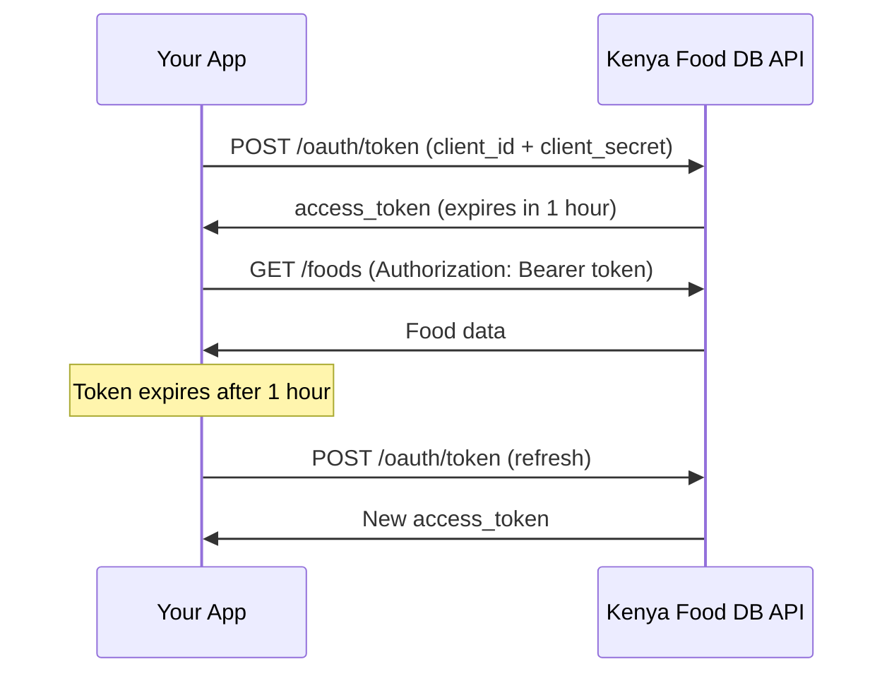

# Frontend Integration Guide - OAuth 2.0 & API Access

## 🎯 Overview

This guide shows how to integrate the Kenya Food DB API into your frontend application using OAuth 2.0 Client Credentials flow.

---

## 📋 Table of Contents

1. [Quick Start](#quick-start)
2. [Authentication Flow](#authentication-flow)
3. [React/Next.js Implementation](#reactnextjs-implementation)
4. [Vue.js Implementation](#vuejs-implementation)
5. [Vanilla JavaScript](#vanilla-javascript)
6. [Error Handling](#error-handling)
7. [Rate Limiting](#rate-limiting)
8. [Best Practices](#best-practices)

---

## 🚀 Quick Start

### **Step 1: Get OAuth Credentials**

1. **Register/Login** to Kenya Food DB
2. **Create OAuth Client** via dashboard or API
3. **Save credentials** (client_id and client_secret)

```bash
POST https://api.kenyafooddb.com/api/v1/oauth/clients
Authorization: Bearer <your-user-jwt>
Content-Type: application/json

{
  "name": "My Mobile App",
  "scopes": ["read:foods", "read:categories", "read:nutrients"]
}

# Response - SAVE THESE!
{
  "client": {
    "clientId": "kfdb_client_abc123xyz",
    "tier": "free",
    "rateLimit": 1000
  },
  "clientSecret": "kfdb_secret_xyz789abc"  // ⚠️ Only shown once!
}
```

---

## 🔐 Authentication Flow



---

## ⚛️ React/Next.js Implementation

### **Option 1: Custom Hook (Recommended)**

```typescript
// hooks/useKenyaFoodDB.ts
import { useState, useEffect, useCallback } from 'react';

interface TokenResponse {
  access_token: string;
  token_type: string;
  expires_in: number;
  scope: string;
}

interface KenyaFoodDBConfig {
  clientId: string;
  clientSecret: string;
  baseUrl?: string;
}

export function useKenyaFoodDB(config: KenyaFoodDBConfig) {
  const [accessToken, setAccessToken] = useState<string | null>(null);
  const [tokenExpiresAt, setTokenExpiresAt] = useState<number>(0);
  const [isLoading, setIsLoading] = useState(false);
  const [error, setError] = useState<Error | null>(null);

  const baseUrl = config.baseUrl || 'https://api.kenyafooddb.com/api/v1';

  // Get access token
  const getAccessToken = useCallback(async (): Promise<string> => {
    // Check if cached token is still valid
    if (accessToken && Date.now() < tokenExpiresAt) {
      return accessToken;
    }

    setIsLoading(true);
    setError(null);

    try {
      const response = await fetch(`${baseUrl}/oauth/token`, {
        method: 'POST',
        headers: {
          'Content-Type': 'application/json',
        },
        body: JSON.stringify({
          grant_type: 'client_credentials',
          client_id: config.clientId,
          client_secret: config.clientSecret,
        }),
      });

      if (!response.ok) {
        throw new Error(`Failed to get access token: ${response.statusText}`);
      }

      const data: TokenResponse = await response.json();
      
      // Set token with 5-minute buffer before expiry
      const expiresAt = Date.now() + (data.expires_in - 300) * 1000;
      
      setAccessToken(data.access_token);
      setTokenExpiresAt(expiresAt);
      
      return data.access_token;
    } catch (err) {
      const error = err instanceof Error ? err : new Error('Unknown error');
      setError(error);
      throw error;
    } finally {
      setIsLoading(false);
    }
  }, [accessToken, tokenExpiresAt, config, baseUrl]);

  // Make authenticated API request
  const apiRequest = useCallback(async <T>(
    endpoint: string,
    options?: RequestInit
  ): Promise<T> => {
    const token = await getAccessToken();

    const response = await fetch(`${baseUrl}${endpoint}`, {
      ...options,
      headers: {
        ...options?.headers,
        'Authorization': `Bearer ${token}`,
        'Content-Type': 'application/json',
      },
    });

    if (!response.ok) {
      if (response.status === 401) {
        // Token expired, retry once with new token
        setAccessToken(null);
        const newToken = await getAccessToken();
        
        const retryResponse = await fetch(`${baseUrl}${endpoint}`, {
          ...options,
          headers: {
            ...options?.headers,
            'Authorization': `Bearer ${newToken}`,
            'Content-Type': 'application/json',
          },
        });

        if (!retryResponse.ok) {
          throw new Error(`API request failed: ${retryResponse.statusText}`);
        }

        return retryResponse.json();
      }

      throw new Error(`API request failed: ${response.statusText}`);
    }

    return response.json();
  }, [baseUrl, getAccessToken]);

  // Convenience methods
  const getFoods = useCallback((params?: {
    page?: number;
    limit?: number;
    search?: string;
  }) => {
    const queryParams = new URLSearchParams();
    if (params?.page) queryParams.set('page', params.page.toString());
    if (params?.limit) queryParams.set('limit', params.limit.toString());
    if (params?.search) queryParams.set('search', params.search);

    const query = queryParams.toString();
    return apiRequest(`/foods${query ? `?${query}` : ''}`);
  }, [apiRequest]);

  const getFoodById = useCallback((id: number) => {
    return apiRequest(`/foods/${id}`);
  }, [apiRequest]);

  const getCategories = useCallback(() => {
    return apiRequest('/categories');
  }, [apiRequest]);

  const getNutrients = useCallback(() => {
    return apiRequest('/nutrients');
  }, [apiRequest]);

  return {
    getFoods,
    getFoodById,
    getCategories,
    getNutrients,
    apiRequest,
    isLoading,
    error,
  };
}
```

### **Usage in Component**

```typescript
// components/FoodList.tsx
import { useKenyaFoodDB } from '@/hooks/useKenyaFoodDB';
import { useEffect, useState } from 'react';

interface Food {
  id: number;
  name: string;
  category: string;
  // ... other fields
}

export default function FoodList() {
  const [foods, setFoods] = useState<Food[]>([]);
  const [loading, setLoading] = useState(true);

  const api = useKenyaFoodDB({
    clientId: process.env.NEXT_PUBLIC_KFDB_CLIENT_ID!,
    clientSecret: process.env.NEXT_PUBLIC_KFDB_CLIENT_SECRET!,
  });

  useEffect(() => {
    async function loadFoods() {
      try {
        setLoading(true);
        const response = await api.getFoods({ page: 1, limit: 20 });
        setFoods(response.data);
      } catch (error) {
        console.error('Failed to load foods:', error);
      } finally {
        setLoading(false);
      }
    }

    loadFoods();
  }, []);

  if (loading) return <div>Loading...</div>;
  if (api.error) return <div>Error: {api.error.message}</div>;

  return (
    <div>
      <h1>Foods</h1>
      <ul>
        {foods.map((food) => (
          <li key={food.id}>{food.name}</li>
        ))}
      </ul>
    </div>
  );
}
```

### **Environment Variables (.env.local)**

```env
NEXT_PUBLIC_KFDB_CLIENT_ID=kfdb_client_abc123xyz
NEXT_PUBLIC_KFDB_CLIENT_SECRET=kfdb_secret_xyz789abc
NEXT_PUBLIC_KFDB_API_URL=https://api.kenyafooddb.com/api/v1
```

⚠️ **Security Note:** For production, store client_secret on the server side, not in the browser!

---

## 🎨 Vue.js Implementation

### **Composable (Vue 3)**

```typescript
// composables/useKenyaFoodDB.ts
import { ref, computed } from 'vue';

interface KenyaFoodDBConfig {
  clientId: string;
  clientSecret: string;
  baseUrl?: string;
}

export function useKenyaFoodDB(config: KenyaFoodDBConfig) {
  const accessToken = ref<string | null>(null);
  const tokenExpiresAt = ref<number>(0);
  const isLoading = ref(false);
  const error = ref<Error | null>(null);

  const baseUrl = config.baseUrl || 'https://api.kenyafooddb.com/api/v1';

  const isTokenValid = computed(() => {
    return accessToken.value && Date.now() < tokenExpiresAt.value;
  });

  async function getAccessToken(): Promise<string> {
    if (isTokenValid.value) {
      return accessToken.value!;
    }

    isLoading.value = true;
    error.value = null;

    try {
      const response = await fetch(`${baseUrl}/oauth/token`, {
        method: 'POST',
        headers: { 'Content-Type': 'application/json' },
        body: JSON.stringify({
          grant_type: 'client_credentials',
          client_id: config.clientId,
          client_secret: config.clientSecret,
        }),
      });

      if (!response.ok) {
        throw new Error(`Failed to get token: ${response.statusText}`);
      }

      const data = await response.json();
      
      accessToken.value = data.access_token;
      tokenExpiresAt.value = Date.now() + (data.expires_in - 300) * 1000;
      
      return data.access_token;
    } catch (err) {
      error.value = err instanceof Error ? err : new Error('Unknown error');
      throw error.value;
    } finally {
      isLoading.value = false;
    }
  }

  async function apiRequest<T>(endpoint: string, options?: RequestInit): Promise<T> {
    const token = await getAccessToken();

    const response = await fetch(`${baseUrl}${endpoint}`, {
      ...options,
      headers: {
        ...options?.headers,
        'Authorization': `Bearer ${token}`,
        'Content-Type': 'application/json',
      },
    });

    if (!response.ok) {
      throw new Error(`API request failed: ${response.statusText}`);
    }

    return response.json();
  }

  async function getFoods(params?: { page?: number; limit?: number }) {
    const query = new URLSearchParams();
    if (params?.page) query.set('page', params.page.toString());
    if (params?.limit) query.set('limit', params.limit.toString());
    
    return apiRequest(`/foods?${query}`);
  }

  async function getFoodById(id: number) {
    return apiRequest(`/foods/${id}`);
  }

  return {
    getFoods,
    getFoodById,
    apiRequest,
    isLoading,
    error,
  };
}
```

### **Usage in Component**

```vue
<!-- components/FoodList.vue -->
<template>
  <div>
    <h1>Foods</h1>
    
    <div v-if="isLoading">Loading...</div>
    <div v-else-if="error">Error: {{ error.message }}</div>
    
    <ul v-else>
      <li v-for="food in foods" :key="food.id">
        {{ food.name }}
      </li>
    </ul>
  </div>
</template>

<script setup lang="ts">
import { ref, onMounted } from 'vue';
import { useKenyaFoodDB } from '@/composables/useKenyaFoodDB';

const foods = ref([]);

const api = useKenyaFoodDB({
  clientId: import.meta.env.VITE_KFDB_CLIENT_ID,
  clientSecret: import.meta.env.VITE_KFDB_CLIENT_SECRET,
});

onMounted(async () => {
  try {
    const response = await api.getFoods({ page: 1, limit: 20 });
    foods.value = response.data;
  } catch (err) {
    console.error('Failed to load foods:', err);
  }
});
</script>
```

---

## 📦 Vanilla JavaScript

### **Simple Client Class**

```javascript
// kenyaFoodDB.js
class KenyaFoodDBClient {
  constructor(clientId, clientSecret, baseUrl = 'https://api.kenyafooddb.com/api/v1') {
    this.clientId = clientId;
    this.clientSecret = clientSecret;
    this.baseUrl = baseUrl;
    this.accessToken = null;
    this.tokenExpiresAt = 0;
  }

  async getAccessToken() {
    // Check if cached token is still valid
    if (this.accessToken && Date.now() < this.tokenExpiresAt) {
      return this.accessToken;
    }

    const response = await fetch(`${this.baseUrl}/oauth/token`, {
      method: 'POST',
      headers: { 'Content-Type': 'application/json' },
      body: JSON.stringify({
        grant_type: 'client_credentials',
        client_id: this.clientId,
        client_secret: this.clientSecret,
      }),
    });

    if (!response.ok) {
      throw new Error(`Failed to get access token: ${response.statusText}`);
    }

    const data = await response.json();
    
    this.accessToken = data.access_token;
    // Set expiry with 5-minute buffer
    this.tokenExpiresAt = Date.now() + (data.expires_in - 300) * 1000;
    
    return this.accessToken;
  }

  async apiRequest(endpoint, options = {}) {
    const token = await this.getAccessToken();

    const response = await fetch(`${this.baseUrl}${endpoint}`, {
      ...options,
      headers: {
        ...options.headers,
        'Authorization': `Bearer ${token}`,
        'Content-Type': 'application/json',
      },
    });

    if (!response.ok) {
      if (response.status === 401) {
        // Token expired, retry with new token
        this.accessToken = null;
        return this.apiRequest(endpoint, options);
      }
      throw new Error(`API request failed: ${response.statusText}`);
    }

    return response.json();
  }

  async getFoods(page = 1, limit = 10) {
    return this.apiRequest(`/foods?page=${page}&limit=${limit}`);
  }

  async getFoodById(id) {
    return this.apiRequest(`/foods/${id}`);
  }

  async getCategories() {
    return this.apiRequest('/categories');
  }

  async getNutrients() {
    return this.apiRequest('/nutrients');
  }
}

// Usage
const client = new KenyaFoodDBClient(
  'kfdb_client_abc123xyz',
  'kfdb_secret_xyz789abc'
);

// Get foods
client.getFoods(1, 20)
  .then(response => {
    console.log('Foods:', response.data);
  })
  .catch(error => {
    console.error('Error:', error);
  });
```

---

## ⚠️ Error Handling

### **Common Errors**

```typescript
async function handleApiRequest() {
  try {
    const foods = await api.getFoods();
    return foods;
  } catch (error) {
    if (error.response) {
      switch (error.response.status) {
        case 401:
          // Unauthorized - invalid token
          console.error('Authentication failed. Check credentials.');
          break;
        
        case 403:
          // Forbidden - insufficient scope
          console.error('Insufficient permissions. Required scope missing.');
          break;
        
        case 429:
          // Rate limit exceeded
          const retryAfter = error.response.headers.get('Retry-After');
          console.error(`Rate limit exceeded. Retry after ${retryAfter} seconds.`);
          break;
        
        case 500:
          // Server error
          console.error('Server error. Please try again later.');
          break;
        
        default:
          console.error('API request failed:', error.message);
      }
    } else {
      // Network error
      console.error('Network error:', error.message);
    }
    
    throw error;
  }
}
```

---

## 📊 Rate Limiting

### **Handling Rate Limits**

```typescript
interface RateLimitInfo {
  limit: number;
  remaining: number;
  reset: number;
}

function extractRateLimitInfo(response: Response): RateLimitInfo {
  return {
    limit: parseInt(response.headers.get('X-RateLimit-Limit') || '0'),
    remaining: parseInt(response.headers.get('X-RateLimit-Remaining') || '0'),
    reset: parseInt(response.headers.get('X-RateLimit-Reset') || '0'),
  };
}

// Usage
async function makeRequest() {
  const response = await fetch(url, options);
  const rateLimit = extractRateLimitInfo(response);
  
  console.log(`Rate limit: ${rateLimit.remaining}/${rateLimit.limit}`);
  
  if (rateLimit.remaining < 10) {
    console.warn('Approaching rate limit!');
  }
  
  if (response.status === 429) {
    const resetDate = new Date(rateLimit.reset * 1000);
    console.error(`Rate limit exceeded. Resets at ${resetDate}`);
  }
  
  return response.json();
}
```

### **Rate Limit Display Component**

```typescript
// components/RateLimitIndicator.tsx
import { useEffect, useState } from 'react';

interface RateLimitProps {
  limit: number;
  remaining: number;
  reset: number;
}

export function RateLimitIndicator({ limit, remaining, reset }: RateLimitProps) {
  const [timeUntilReset, setTimeUntilReset] = useState('');
  
  useEffect(() => {
    const interval = setInterval(() => {
      const now = Date.now();
      const resetTime = reset * 1000;
      const diff = resetTime - now;
      
      if (diff <= 0) {
        setTimeUntilReset('Reset now');
      } else {
        const hours = Math.floor(diff / 3600000);
        const minutes = Math.floor((diff % 3600000) / 60000);
        setTimeUntilReset(`${hours}h ${minutes}m`);
      }
    }, 1000);
    
    return () => clearInterval(interval);
  }, [reset]);
  
  const percentage = (remaining / limit) * 100;
  const isLow = percentage < 20;
  
  return (
    <div className={`rate-limit ${isLow ? 'low' : ''}`}>
      <div className="rate-limit-bar">
        <div 
          className="rate-limit-fill" 
          style={{ width: `${percentage}%` }}
        />
      </div>
      <div className="rate-limit-text">
        {remaining} / {limit} requests remaining
        <span className="reset-time">Resets in {timeUntilReset}</span>
      </div>
    </div>
  );
}
```

---

## ✅ Best Practices

### **1. Secure Credential Storage**

❌ **Don't do this (Client-side):**
```javascript
// NEVER expose client_secret in browser code!
const client = new KenyaFoodDBClient(
  'kfdb_client_abc123xyz',
  'kfdb_secret_xyz789abc' // ❌ Exposed to users!
);
```

✅ **Do this (Server-side):**
```typescript
// Next.js API Route: /api/foods
export async function GET(request: Request) {
  const client = new KenyaFoodDBClient(
    process.env.KFDB_CLIENT_ID!,
    process.env.KFDB_CLIENT_SECRET! // ✅ Secure on server
  );
  
  const foods = await client.getFoods();
  return Response.json(foods);
}

// Frontend calls your API
const response = await fetch('/api/foods');
const foods = await response.json();
```

### **2. Token Caching**

```typescript
// Cache token in memory (not localStorage for security)
class TokenManager {
  private static token: string | null = null;
  private static expiresAt: number = 0;
  
  static isValid(): boolean {
    return this.token !== null && Date.now() < this.expiresAt;
  }
  
  static set(token: string, expiresIn: number) {
    this.token = token;
    this.expiresAt = Date.now() + (expiresIn - 300) * 1000;
  }
  
  static get(): string | null {
    return this.isValid() ? this.token : null;
  }
  
  static clear() {
    this.token = null;
    this.expiresAt = 0;
  }
}
```

### **3. Request Batching**

```typescript
// Batch multiple requests
async function loadDashboardData() {
  const [foods, categories, nutrients] = await Promise.all([
    api.getFoods({ limit: 10 }),
    api.getCategories(),
    api.getNutrients(),
  ]);
  
  return { foods, categories, nutrients };
}
```

### **4. Retry Logic**

```typescript
async function fetchWithRetry<T>(
  fn: () => Promise<T>,
  maxRetries = 3,
  delay = 1000
): Promise<T> {
  for (let i = 0; i < maxRetries; i++) {
    try {
      return await fn();
    } catch (error) {
      if (i === maxRetries - 1) throw error;
      
      // Exponential backoff
      await new Promise(resolve => setTimeout(resolve, delay * Math.pow(2, i)));
    }
  }
  
  throw new Error('Max retries exceeded');
}

// Usage
const foods = await fetchWithRetry(() => api.getFoods());
```

### **5. Loading States**

```typescript
function useFoods() {
  const [data, setData] = useState(null);
  const [loading, setLoading] = useState(true);
  const [error, setError] = useState(null);
  
  useEffect(() => {
    let cancelled = false;
    
    async function load() {
      try {
        setLoading(true);
        setError(null);
        
        const result = await api.getFoods();
        
        if (!cancelled) {
          setData(result);
        }
      } catch (err) {
        if (!cancelled) {
          setError(err);
        }
      } finally {
        if (!cancelled) {
          setLoading(false);
        }
      }
    }
    
    load();
    
    return () => {
      cancelled = true;
    };
  }, []);
  
  return { data, loading, error };
}
```

---

## 🔒 Security Checklist

- [ ] **Never** expose client_secret in browser code
- [ ] Store credentials in environment variables
- [ ] Use server-side API routes for sensitive operations
- [ ] Implement proper error handling
- [ ] Cache tokens securely (memory, not localStorage)
- [ ] Validate all API responses
- [ ] Use HTTPS in production
- [ ] Implement request timeouts
- [ ] Log errors for monitoring
- [ ] Rate limit your own requests

---

## 📚 Additional Resources

- [OAuth 2.0 Specification](https://oauth.net/2/)
- [API Documentation](https://api.kenyafooddb.com/docs)
- [Rate Limiting Guide](./RATE_LIMITING_STRATEGY.md)
- [Error Codes Reference](./ERROR_CODES.md)

---

## 🆘 Support

**Issues?**
- Check API status: https://status.kenyafooddb.com
- Review error logs in browser console
- Verify credentials are correct
- Check rate limit headers

**Contact:**
- Email: support@kenyafooddb.com
- Discord: https://discord.gg/kenyafooddb
- GitHub Issues: https://github.com/kenyafooddb/api/issues

---

**Last Updated:** November 3, 2025  
**API Version:** v1  
**Status:** Production Ready
